# Online Cab Service

A full-stack PHP web application that connects passengers with cab drivers through a ride request and approval system, featuring three distinct user roles: Admin, Passenger, and Driver, each with their own dashboard and permissions.

**Tech stack:** PHP, MySQL, HTML5, CSS3, Bootstrap

---

## Overview

Online Cab Service was built as a 4-wheeler ride booking platform that solves a simple but real problem: passengers and drivers often struggle to find each other at the time they need to. The system gives passengers a way to submit ride requests with their current location and destination, lets drivers view and respond to nearby requests, and gives admins full visibility into users, drivers, feedback, and ride history across the platform.

---

## Features

**Public Site**
- Home page with project introduction and booking call-to-action
- About Project page explaining the platform's purpose and core functionality
- Registration form supporting both Passenger and Driver sign-ups, including name, contact details, date of birth, address, gender, and user type selection
- Role-based login system (Admin, Passenger, Driver) with a single login form and a role selector
- Contact Us page for general inquiries and feedback submission

**Passenger Dashboard**
- View personal ride history
- Apply for a new ride by submitting current location and destination
- View remaining/active ride requests
- Edit or delete personal account

**Driver Dashboard**
- View and manage incoming ride requests from passengers
- Manually approve or reject each ride request
- Track self-initiated rides and ride status
- Edit or delete personal account
- Basic fare calculation logic to estimate ride cost between locations

**Admin Dashboard**
- View all feedback submitted through the platform
- Full ride history across all users and drivers, including time, contact number, current location, destination, and assigned driver
- Complete user details table listing all registered passengers with contact info, date of birth, address, gender, and join date
- Complete driver details table listing all registered drivers with the same structured information
- Centralized oversight of platform activity

---

## Tech Stack

| Layer | Technology |
|---|---|
| Backend | PHP (procedural) |
| Database | MySQL |
| Frontend | HTML5, CSS3, Bootstrap |
| Tools | phpMyAdmin, XAMPP/Localhost |

---

## Database Structure

The application uses 3 core tables:

- `tbl_user` — id, name, username, password, mobile, email, date_of_birth, address, gender, user_type (Passenger/Driver/Admin), date_of_join
- `apply_ride` — id, current_location, destination, time, userid (foreign key to tbl_user), status (approve/reject), driver_name, remarks
- `contact` — id, name, email, mobile, message (stores both contact form submissions and feedback)

---

## Screenshots

### Home Page
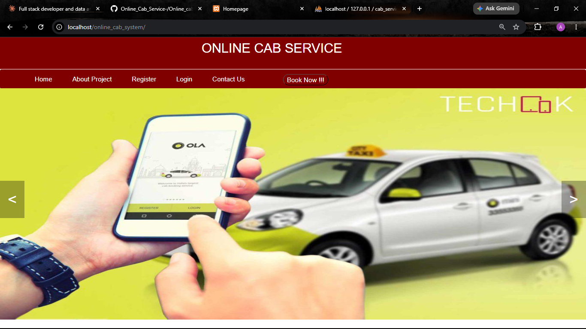

### About Project
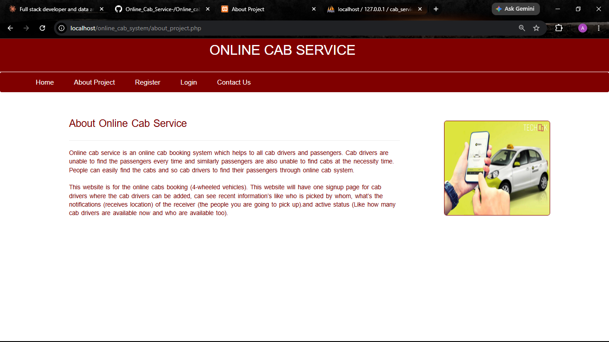

### Registration Form
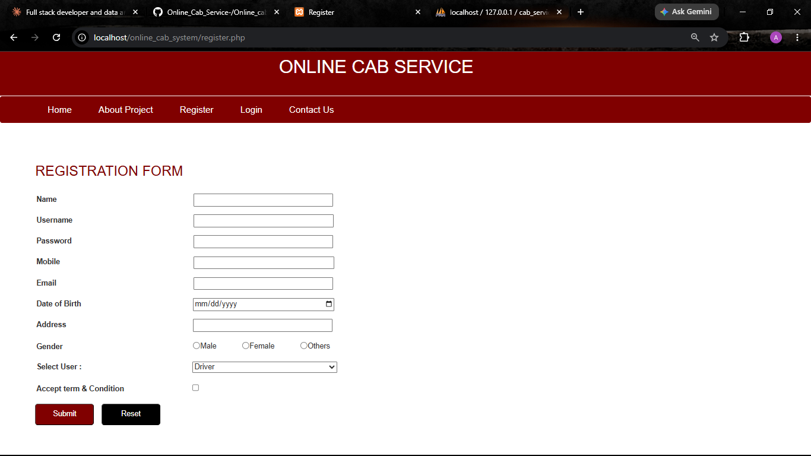

### Login Page
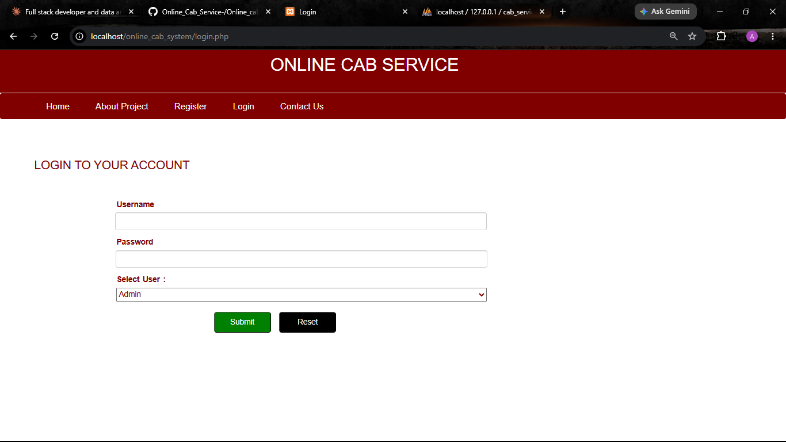

### Admin — Feedback View
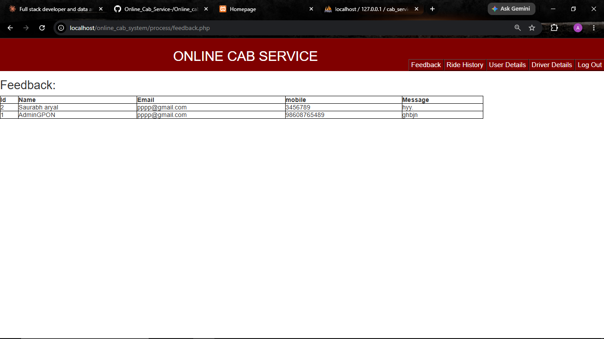

### Admin — Ride History
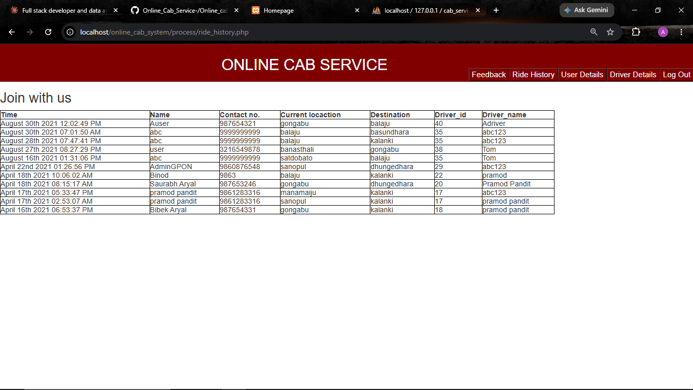

### Admin — User Details
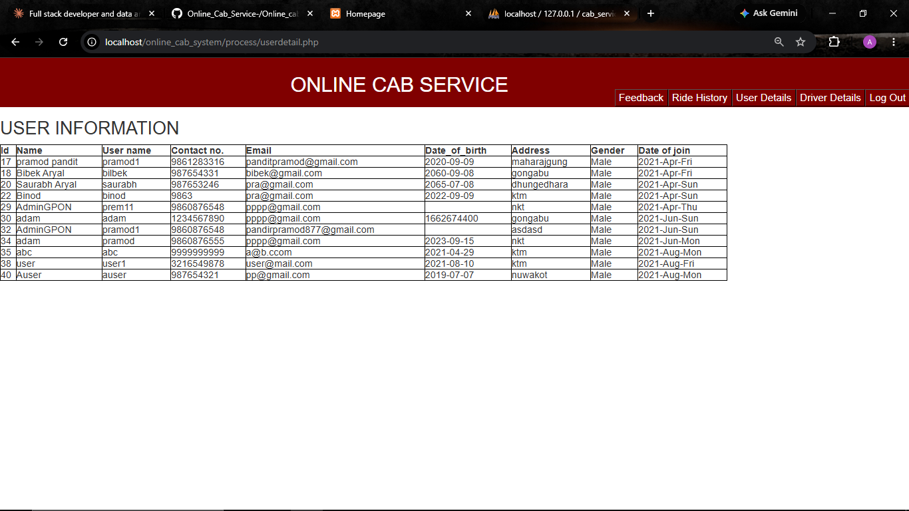

### Admin — Driver Details
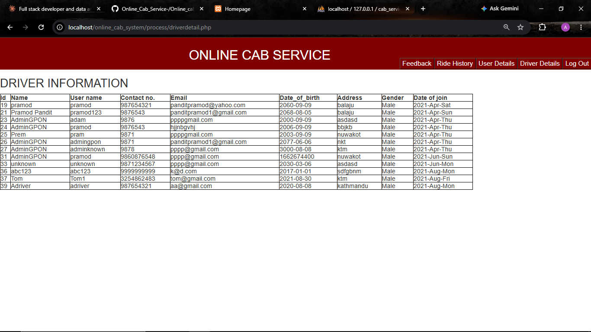

### Passenger Profile
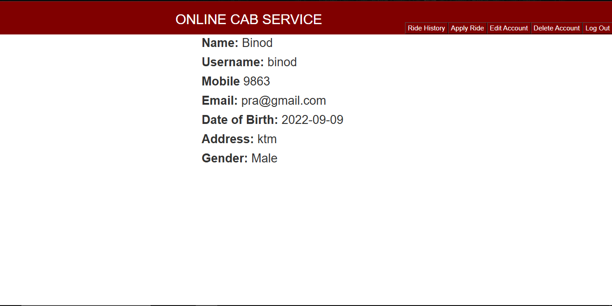

### Passenger — Apply for Ride
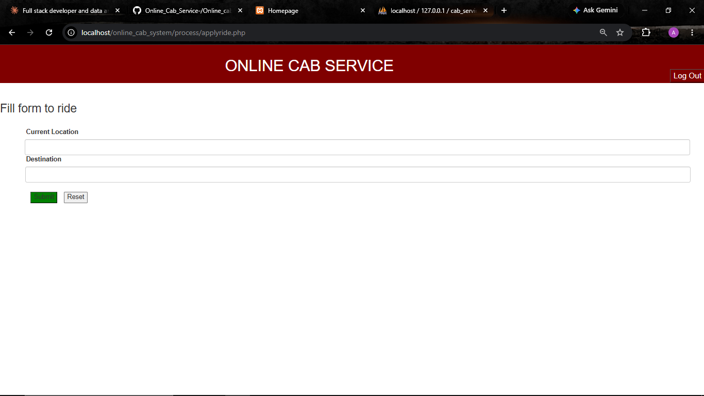

### Passenger — Remaining Ride
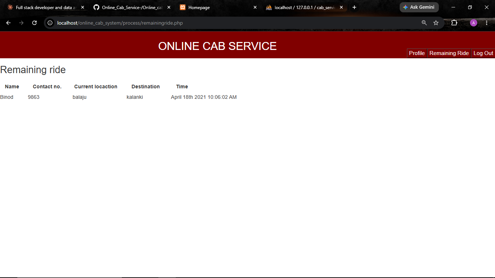

### Driver Profile
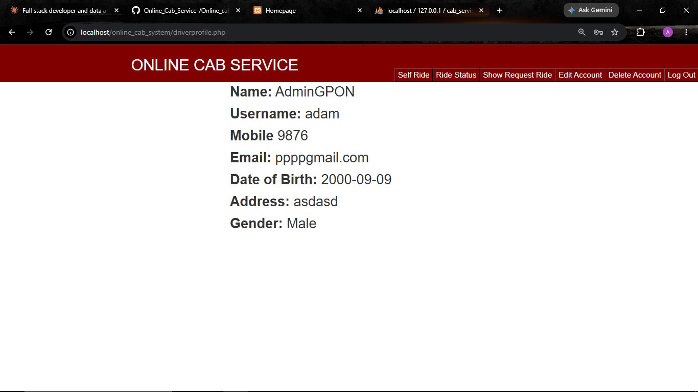

### Driver — Incoming Ride Requests
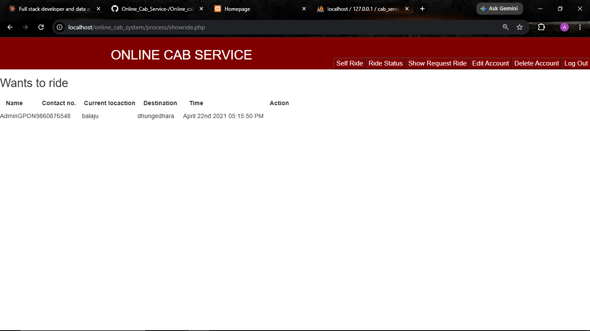

---

## Project Structure

```
online_cab_system/
├── css/
├── db/
│   └── connection.php
├── img/
├── include/
├── js/
├── process/
│   ├── admin.php
│   ├── feedback.php
│   ├── ride_history.php
│   ├── userdetail.php
│   ├── driverdetail.php
│   ├── applyride.php
│   ├── remainingride.php
│   └── showride.php
├── home.php
├── about_project.php
├── register.php
├── login.php
├── contactus.php
├── userprofile.php
├── driverprofile.php
└── cab_service.sql
```

---

## Getting Started

**Prerequisites:** PHP 7.4+, MySQL, a local server environment such as XAMPP or WAMP

1. Clone the repository
   ```
   git clone https://github.com/saurabharyal10/Online_Cab_Service-.git
   ```
2. Place the project folder inside your local server's root directory (e.g. `htdocs` for XAMPP)
3. Create a MySQL database named `cab_service`
4. Import `cab_service.sql` into the database via phpMyAdmin
5. Update database credentials in `db/connection.php` if needed
6. Visit `http://localhost/online_cab_system/` in your browser
7. Register as a Passenger or Driver, or log in as Admin to access the management views

---

## Author

**Saurabh Aryal**
Full Stack Developer & Data Analyst
[Portfolio](https://saurabh-aryal.com.np) · [LinkedIn](https://www.linkedin.com/in/saurabh-aryal-0b4b80209/) · [GitHub](https://github.com/saurabharyal10)
